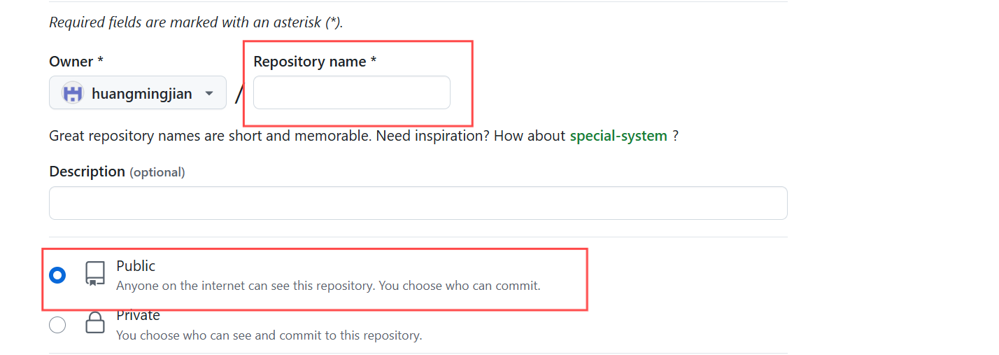
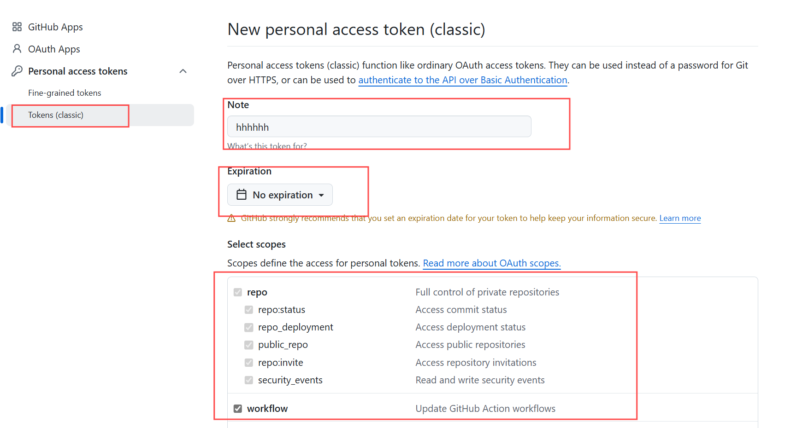
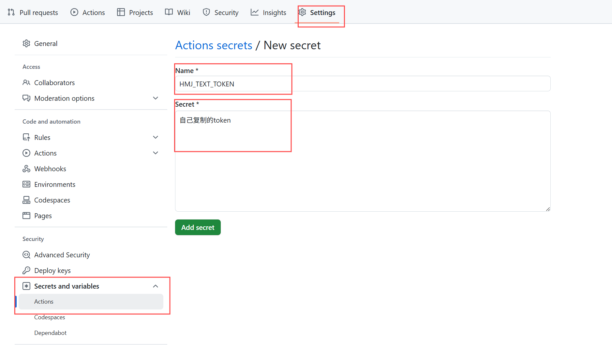
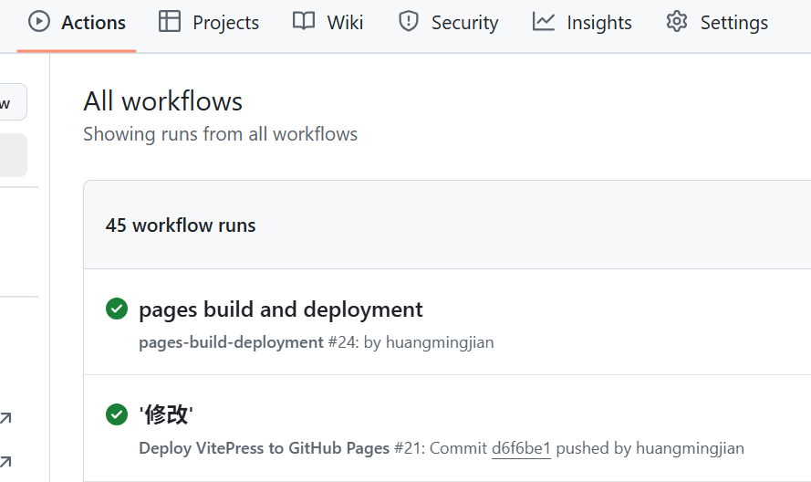
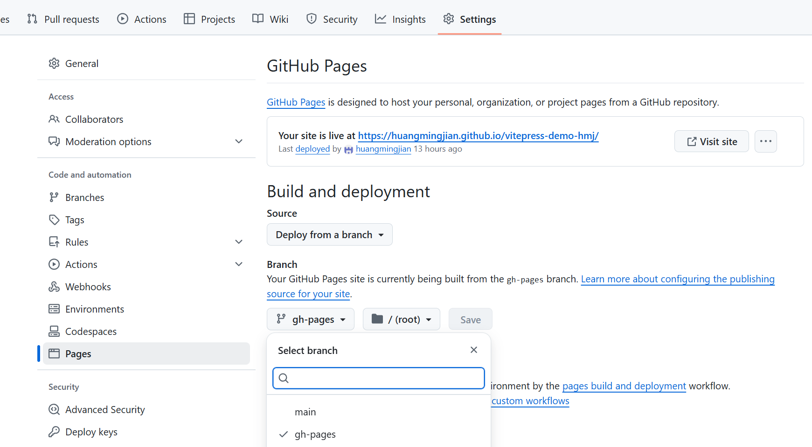

# github部署
我们基本完成了一个博客的搭建。那搭建完成以后，就是发布上线啦~
首先，我们采用Github Page来进行部署,没有账号的可以去注册一个，任何做一些部署前的准备。
## 1、创建Github仓库
登录 https://github.com/ 创建账号,创建一个仓库，名称自己定，这里我使用 vitepress-demo-hmj。

然后把我们的代码推送到github仓库中。
```md
git init
git commit -m "first commit"
git branch -M main
//地址自己仓库仓库地址
git remote add origin https://github.com/huangmingjian/vitepress-demo-hmj.git
git push -u origin main
```
后续的代码修改都是通过git进行推送，后续的分支管理规范自己学习吧。

## 2、创建Github仓库
在项目根目录下创建 .github/workflows/deploy.yml 文件，内容如下：
其中secrets.HMJ_TEXT_TOKEN在第三步中获取。secrets默认应该设置GITHUB_TOKEN用于访问当前仓库的 GitHub API 令牌，具有与当前工作流相同的权限。如果后续在部署时出现权限不足时,可以自定义token。
```md
name: Deploy VitePress to GitHub Pages

on:
  push:
    branches:
      - main  # 触发部署的分支，默认为 main

jobs:
  deploy:
    runs-on: ubuntu-latest  # 使用最新的 Ubuntu 环境

    steps:
      - name: Checkout code
        uses: actions/checkout@v3  # 拉取代码

      - name: Set up Node.js
        uses: actions/setup-node@v3  # 设置 Node.js 环境
        with:
          node-version: 22.15.0  # 指定 Node.js 版本

      - name: Install dependencies
        run: npm install  # 安装依赖

      - name: Build VitePress
        run: npm run docs:build  # 构建 VitePress 项目

      - name: Deploy to GitHub Pages
        uses: peaceiris/actions-gh-pages@v3  # 使用 GitHub Pages 部署 Action
        with:
          github_token: ${{ secrets.HMJ_TEXT_TOKEN }}  # GitHub Token
          publish_dir: docs/.vitepress/dist  # 构建输出的目录
```
## 3、获取自定义token
1.进入 GitHub Settings → Developer Settings → Personal Access Tokens → Tokens (classic)。
2.点击 Generate new token → Generate new token (classic)。
3.填写Note: Deploy to GitHub Pages（描述用途）,Expiration: 建议选择有效期（如 90 天）,Scopes: 勾选 repo（全仓库权限）和 workflow（如需操作 Actions）其他权限自己根据需求勾选,点击 Generate token，复制生成的 Token。



4.进入你的仓库，点击 Settings > Secrets and variables > Actions,点击 New repository secret,在 Name 字段中输入 HMJ_TEXT_TOKEN，在 Value 字段中输入你的密钥值（如 API 令牌）,点击 Add secret 保存。


5.然后修改.github/workflows/deploy.yml 文件,并使用git提交
```md
github_token: ${{ secrets.HMJ_TEXT_TOKEN }} 
```
## 4、查看部署结果
在代码上传后，在github actions中查看部署结果，后续报错需要自己点进行查看问题代码。

然后在setting中查看部署结果,在部署完成后会有个gh-pages分支，然后有个项目地址,就可以给其他人查看啦。


## 4、可能碰到的问题
1.首页图片部署后加载不出来,那是因为一定需要把图片放在 根目录-docs-public下面才行，具体问题查看官方文档https://vitepress.dev/guide/asset-handling#the-public-directory。

2.部署后点击路由404,那是因为进入路由的绝对路径不对,可能在开发环境可以访问,但是部署后访问不了,link设置为'/linklocation/learn-vitepress',如果设置为'../linklocation/learn-vitepress' 会造成路由查找错误。

3.这个问题很奇怪,我有个图片名字随便设置的，名字为vueList,然后github pages部署后,报错找不到图片。但是我改了个名称就可以了，很奇怪。