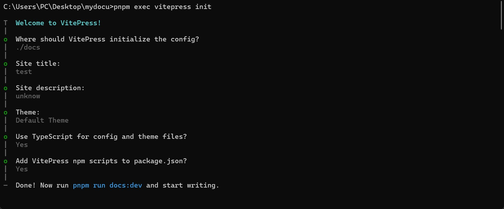
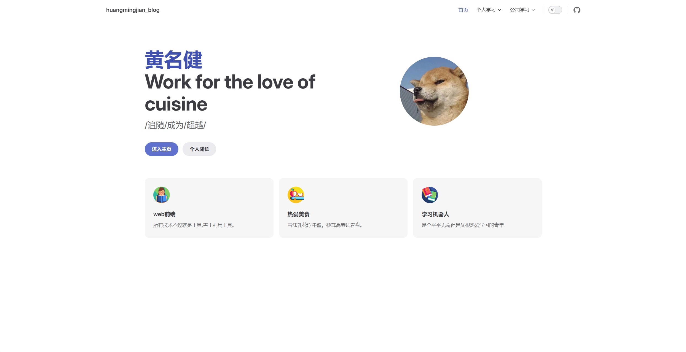
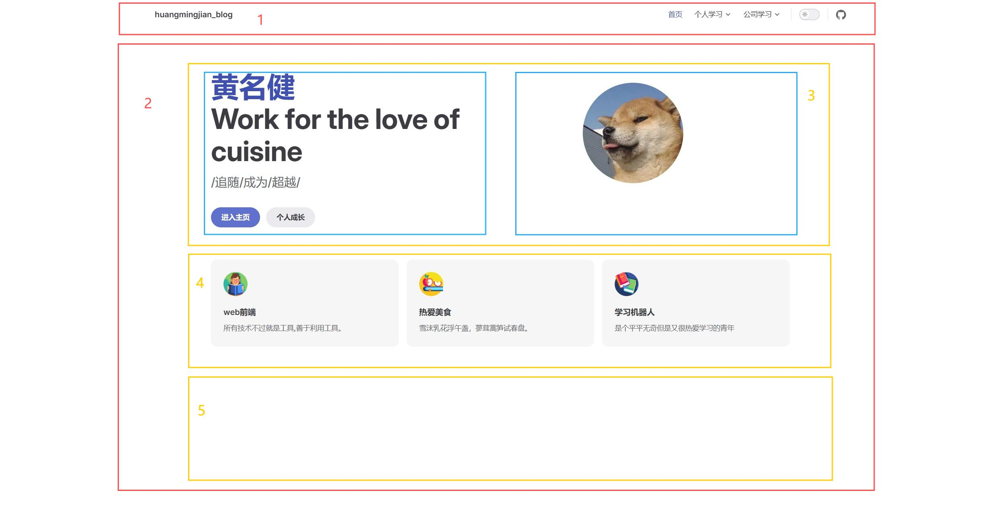
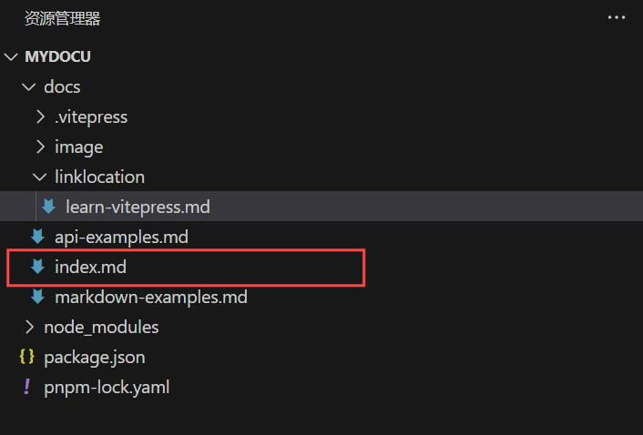
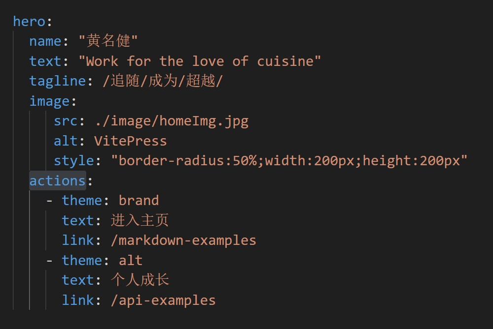
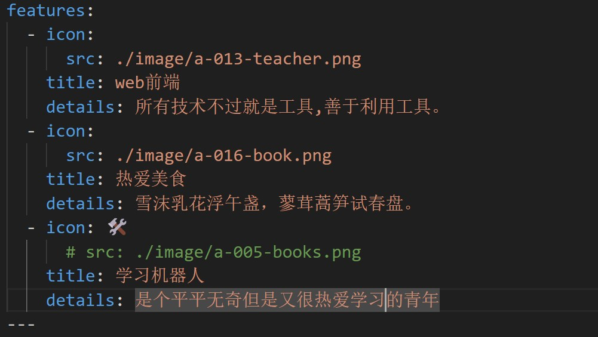

# 前言

在公司发布的培养计划中发现了 `vitepress`,在官网做了个简单了解，`VitePress` 是一个静态站点生成器，专为构建快速、以内容为中心的站点而设计。为了学习 `VitePress`，我决定自己搭建一个站点，作为学习笔记。

在下面文章中，将带你从0到1用`VitePress`搭建一个站点，从初始化到项目部署。一起来看看，后续有什么建议可以联系我(1401937586@qq.com)。

## 一.项目开始

### 1.1、创建目录
在桌面创建一个文件名,这里创建mydocu目录，并进入目录。然后使用你喜欢的包管理工具进行初始化。这里我用pnpm,如下代码所示:
```md
# 如果没有安装过pnpm，可以全局安装下
sudo npm install -g pnpm
# 用pnpm初始化
pnpm init
```
项目初始化完成后,使用pnpm将vitepress安装为本地依赖:如下代码所示:
```md
# 安装命令
pnpm add vitepress -D

# 如果使用pnpm初始化的话，需要在package.json加上一下代码
"pnpm": {
  "peerDependencyRules": {
    "ignoreMissing": [
      "@algolia/client-search"
    ]
  }
}
```
### 1.2、创建项目
在vitepress官方文档中提到，vitepress附带了一个命令行向导，来帮助我们构建一个基本的项目。通过以下命令来执行该操作:
```md
pnpm exec vitepress init
```
构建完成如下图所示:

此时文件的目录结构是这样的，日下树状代码所示:
```md
├─ docs
│  ├─ .vitepress
│  │  └─ config.js
│  ├─ api-examples.md
│  ├─ markdown-examples.md
│  └─ index.md 入口文件
└─ package.json
```
到这里，我们就基本完成了vitepress项目的初始化。最后，我们运行 pnpm run docs:dev 来打开项目。效果如下:

这里页面展示稍微有些不同,我是美化了一下,后面我们会学习如何配置。
## 二.配置美化
基础框架我们已经搭建完成,接下来我们需要对博客进行进一步美化。

2.1、整体布局
对于vitepress来说，刚进去的那一刻，映入眼帘的就是首页，也就是docs/index.md这个文件。首页主要由以下五个部分组成：



1.导航栏:官网学习 https://vitepress.dev/zh/reference/default-theme-nav#nav,具体配置查看后续。

2.主体内容: index.md文件。


3.内容主体:index.md文件配置hero,image配置右边头像,actions配置活动按钮。


4.内容展示框:index.md文件配置features内容。


5.自定义内容: 可以自己编写vue组件，然后引入到index.md中进行展示。

