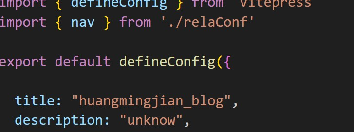
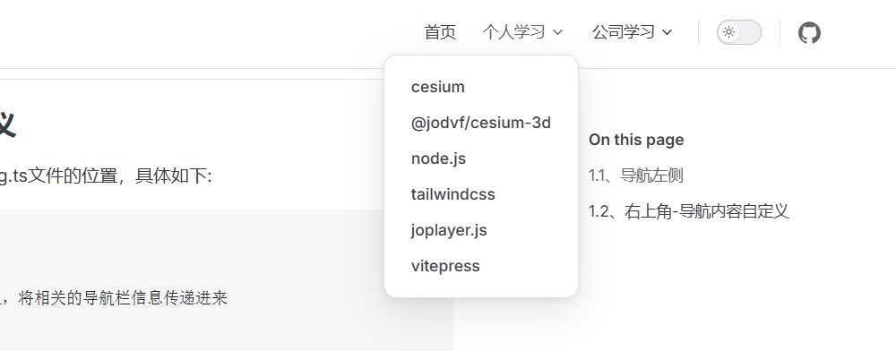

# 导航栏配置
## 1.1、导航左侧
需要配置 config.mts 文件下的title，如下代码所示:


## 1.2、右上角-导航内容自定义
首先先确定nav在docs/.vitepress/config.ts文件的位置，具体如下:

```md
export default defineConfig({
    themeConfig: {
        nav: [] // 这里传入一个数组，将相关的导航栏信息传递进来
    }
})
```
位置有了，接下来我们来定义navbar的内容。具体代码如下：

```md
// docs/.vitepress/relaConf/index.ts 配置内容较多，单独起个文件
export * from './navbar';

// docs/.vitepress/relaConf/navbar.ts
import { DefaultTheme } from "vitepress";
export const nav: DefaultTheme.NavItem[] = [
    { 
      text: '首页',
      link: '/'
    },
    {
        text:'个人学习',
        items:[
            { text: 'cesium', link: '../linklocation/learn-vitepress' },
            { text: '@jodvf/cesium-3d', link: '/frontend/' },
            { text: 'node.js', link: '/frontend/' },
            { text: 'tailwindcss', link: '/frontend/' },
            { text:'joplayer.js',link:'/frontend/'},
            { text: 'vitepress', link: '../linklocation/learn-vitepress' }
        ]
    },{
        text:'公司学习',
        items:[
            { text: '产品谱系', link: '/frontend/' },
            { text: '组织架构', link: '/frontend/' },
            { text: '业务领域', link: '/frontend/' },
            { text: '技术优势', link: '/frontend/' }
        ]
    }
]

// 在config.mts中引用
import { defineConfig } from 'vitepress'
import { nav } from './relaConf'

export default defineConfig({

  title: "huangmingjian_blog",
  description: "unknow",
  themeConfig: {
    nav: nav,
    socialLinks: [
      { icon: 'github', link: 'https://github.com/vuejs/vitepress' }
    ]
  }
})
```
到这里，我们就完成了navbar的美化。具体来看下效果:


更多导航栏配置可以根据官方文档进行学习（https://vitepress.dev/zh/reference/default-theme-nav）。