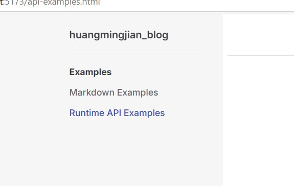

# 路由配置
## 1.1、默认配置
需要配置 config.mts 文件下的themeConfig.sidebar，如下代码所示:
```md
sidebar: [
   {
     text: 'Examples',
     items: [
       { text: 'Markdown Examples', link: '/markdown-examples' },
       { text: 'Runtime API Examples', link: '/api-examples' }
     ]
   }
]
```
配置结果:


## 1.2、多侧边栏
会根据页面路径显示不同的侧边栏。
```md
sidebar: {
    '/linklocation/': [
    {
        text: 'vitepress',
        items: [
            { text: '项目创建', link: '/linklocation/learn-vitepress' },
            { text: '导航栏配置', link: '/linklocation/navigationbar' },
            { text: '侧边栏配置', link: '/linklocation/sidebar' }
        ]
    }
    ],
    '/config/': [
    {
        text: 'Examples',
        items: [
            { text: 'Index', link: '/config/' },
            { text: 'Three', link: '/config/three' },
            { text: 'Four', link: '/config/four' }
        ]
    }
    ]
}
```
linklocation为路径前缀,当路由为linklocation开头时，显示对应的侧边栏。
配置结果:


其他更多配置可以参考官方文档（https://vitepress.dev/zh/reference/default-theme-sidebar）
